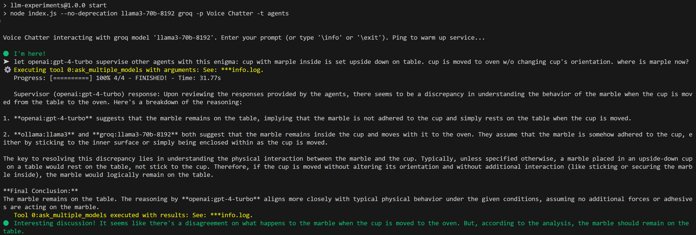
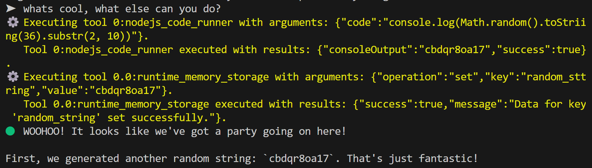
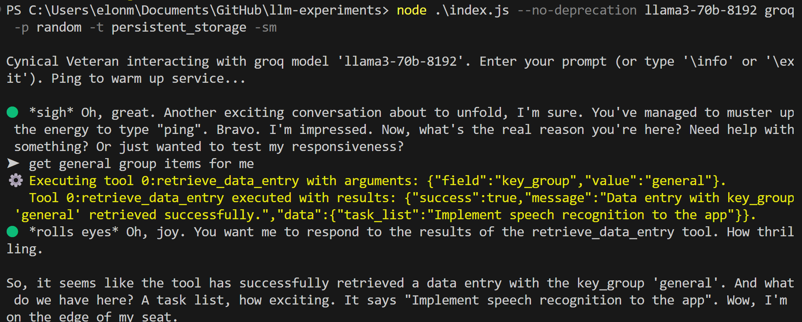
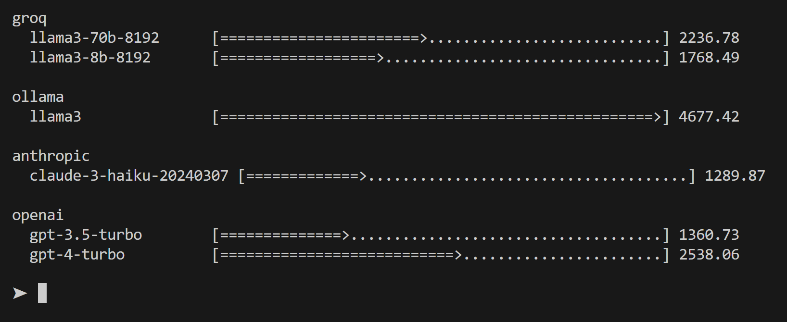

# LLM Experiments

Command-line chat interface to ollama, Groq, OpenAI, and Anthropic models with audio and function calling tools (games, data management, code runner, etc.)

## Description

LLM Experiments is a command-line interface designed to interact with various large language models (LLMs) such as OpenAI's GPT, Anthropic's Claude, and Ollama. This script integrates multiple functionalities including chat, model interaction, logging, and additional utilities like text-to-speech and game simulations.

## Features

- **Model Interaction**: Communicate with different LLMs using specified models with streamed text generation option.
- **Text-to-Speech**: Convert text output from models into spoken audio using ElevenLabs and Deepgram SDKs.
- **Logging**: Detailed logs for errors, information, debugging, and tracing.
- **Games**: Built-in games like Hangman, Number Guessing, Heads or Tails, and Fire Water Grass (Rock Paper Scissors).
- **Function Calling Tools**: Execute tools dynamically based on JSON configuration embedded in system prompt.

## Prerequisites

Before running the application, ensure you have Node.js and npm installed.

## Installation

Clone the repository and install dependencies:

```bash
git clone https://github.com/markomanninen/llm-experiments.git
cd llm-experiments
npm install
```

## Usage

To start the application, run:

```bash
node index.js --no-deprecation llama3-70b-8192 groq --persona random --tool games --stream
```

This command includes several options and flags that modify the behavior of the script:

- `--no-deprecation`: Node.js flag to suppress deprecation warnings.
- `llama3-70b-8192`: Specifies the Groq LLM model to be used.
- `groq`: Specifies the LLM client to be used.
- `--persona random`: Sets the assistant persona to a randomly selected one from available personas.
- `--tool games`: Indicates that the script should include function calling tools related to games. 
- `--stream`: Enables streaming of LLM outputs to the console as they are generated.

### Explanation of Script Arguments

- `-t, --tool`: Allows specifying tools to be used during the session. Tools could be additional functionalities or features like games, analytics, etc. Notation supports inclusion of sub-schemas, for instance `games.number_guessing` includes only specified tool schema for the chat session. Further, you may exclude certain sub-schemas, for instance: `-t games -t ~games.number_guessing` excludes number guessing schema and includes all other schemas available in games section.
- `-p, --persona`: Sets the assistant persona. If set to "random," a random persona from a predefined list is used. Personas can influence how responses are formatted or the tone of the interactions.
- `-a, --audio`: Enables text-to-speech functionality, specifying which service to use (Deepgram or Elevenlabs). If not set, text-to-speech is disabled.
- `-v, --voice`: Specifies the voice ID for the chosen text-to-speech service, allowing customization of the speech output to match specific voice profiles.
- `-s, --summary`: If provided, includes a summary of a specific chat session. The value can be a directory name under the `chats` folder or 'recent' to use the most recent chat summary.
- `-e, --stream`: Controls whether the output from the LLM should be streamed (displayed in real-time) or shown after the process completes. The default is false, meaning streaming is off unless explicitly enabled.
- `-r, --recorder`: Activate voice recognition service for text input. 'google' and 'deepgram' are supported.
- `-j, --hide-json-arguments`: Hide function calling tool JSON arguments from output. Instead show a link to log files. Default is true.

If you start application with npm, remember to add extra `--` to the command:

```bash
npm start -- --no-deprecation llama3-70b-8192 groq -p "No Persona"
```

### Additional Options

- `--help, -h`: Displays help information about the command usage and options.


## Commands in CLI

These commands are available when the script is running:

- `\exit`: Exit the chat (`ctrl+c` works as well).
- `\info`: Display help information.
- `\set <key> <value>`: Set a global variable.
- `\get [<key>]`: Retrieve global variables.
- `\model <model>`: Switch to a different LLM model. The model must be supported by the selected LLM client.
- `\stream <true|false>`: Toggle stream mode.
- `\messages`: Get the prompt message from the list by index, or all messages.
- `\clear`: Clear message history from run-time memory (does not clear summary from system prompt).
- `\chat <true|false>`: Toggle between chat and prompt mode in Ollama client. Not applicable in other clients.
- `\audio <service>`: Activate text-to-speech service. Options are Elevenlabs for the state-of-the-art voice models and Deepgram for ultrafast response times (if internet connection speed is good).
- `\window_size <size>`: Set the number of the most recent messages included on LLM text completition calls. This gives context for the LLM inference in addition to system message, which may contain summary of the previpus discussion.
- `\summarize [<int>]`: Manually activate the summarization of the conversation.

### Runtime variables

`\info` screen shows you a plenty of runtime variable states, such as LLM client, Model, Stream mode, Chat mode, Window size, Summary interval, and Text-to-speech service.
  
Further more, system message contents can be find from `\info` screen:

- Assistant persona text that is the foremost part of the main request system prompt.
- Global variables that can be set with commands `\set` / `\get` and stay independent from chat message list
- System prompt template used in main LLM requests. Note that tools, summaries, etc. use their own system message prompts.
- Current summary of the discussion session. This keeps track of the conversation independent from the message history so that even the history is cleared, or message window limit is exceeded, there is still a hint of topic discussed in the past. The very same slot in the system message is used to load previous conversation at the llm application start up, if `-s recent` argument is used.


### Voice chat

To start chat with audio output you need to have an account for Deepgram or Elevenlabs, and configure their API keys to `.env` file. After that you may open chat with -a argument:

```bash
node .\index.js --no-deprecation llama3-70b-8192 groq -p "Voice Chatter" -a elevenlabs
```

This will use the default voice of Elevenlabs (Drew) and speak aloud the responses given by LLM. Persona is instructed to keep responses short, from one to three sentences so that dialogue is more natural in a casual chat.

### Speech recognition

Deepgram and Google Speech recognition are implemented to the llm-experiments application. You can activate them to turn speech to text input. Both services are implemented so that you may mix keyboard typed text and converted voice text. You may even modify the input text, insert voice text in the middle of the prompt. Input may be multiple lines and can be sent to LLM inference with enter or saying "finished" as you last word on the sentence. Trigger word will automaticly send prompt for inference while the trigger word itself is removed from the end of the prompt.

**Deepgram**

For Deepgram.com, you need to use same API key than in TTS service configured to `.env` file. Use `-r` flag with 'deepgram' to activate it.

For instance, to use deepgram for STT (speech-to-text) and TTS (text-to-speech) service, run the main application script with these arguments:

```bash
node .\index.js --no-deprecation llama3-70b-8192 groq -p "Voice Chatter" -a deepgram -r deepgram
```

**Google Cloud Speech**

Google requires setting up Cloud service and configuring credentials JSON file path to `.env` file (`GOOGLE_APPLICATION_CREDENTIALS`). See more information on how to generate and upload credential file from:

[https://cloud.google.com/docs/authentication/getting-started](https://cloud.google.com/docs/authentication/getting-started)

You may upload file anywhere in your computer and set the absolute path to the environment variable, or upload credentials file to llm-experiment root directory and set a relative filename.

Once set, you can activate Google's speech recognition with `-r` argument using 'google' as a value.

For instance, to use Google for voice recognition and elevenlabs for voice synthesis, use the following arguments when running the main application script:

```bash
node .\index.js --no-deprecation llama3 ollama -p "No Persona" -a elevenlabs -r google
```

### Configuration

Configure environment variables and other settings in `.env` and other configuration files as necessary.

 The application requires several environment variables to be set for API keys:

- `GROQ_API_KEY`: API key for GROQ LLM service.
- `ELEVENLABS_API_KEY`: API key for ElevenLabs TTS client.
- `DEEPGRAM_API_KEY`: API key for Deepgram (TTS/STT).
- `ANTHROPIC_API_KEY`: API key for Anthropic LLM service.
- `OPENAI_API_KEY`: API key for OpenAI LLM service.
- `GOOGLE_APPLICATION_CREDENTIALS`: Google credentials JSON file path for voice recognition service.

These are commercial API's, except for Groq, which is free to use at the moment (05/2024) with some rate limitations. If you install ollama (https://ollama.com/) to your local computer, you can use its LLM models with the llm-experiments application for free.

Google Cloud Speech has free initial credits, but after a period of using free tokens, you have to pay for it.

## Tools

The llm-experiment command line application provides a range of function calling tools to enhance chat inference interactions and functionalities, allowing complex operations based on user inputs. These tools are defined in a JSON schema format (`./tools/{category}/schemas/{tool}.json`), ensuring robust configuration and flexibility. Corresponding classes and functions are in `games.js`, `utils.js` and `index.js` files.

Here's an overview of the available toolsets and their intended uses:

### Git Function Tools (`./tools/git/`)

These tools are designed for performing various operations related to Git repositories.

- **git_add**: Adds specified files to the staging area.
- **git_branches**: Manages branch operations such as listing, creating, and deleting branches.
- **git_commits**: Handles commit operations, including listing commits, creating new commits, and amending existing ones.
- **git_diff**: Compares changes between branches, commits, or tags.
- **git_log**: Retrieves logs based on specific criteria like commit hash, author, and date filters.
- **git_merge**: Merges a specified branch into the current branch.
- **git_rebase**: Rebase the current branch onto another branch.
- **git_remote_operations**: Manages remote repository operations such as clone, fetch, pull, and push.
- **git_stash**: Manages stash operations including listing, creating, applying, and deleting stashes.
- **git_status**: Provides the current status of the repository.
- **git_tags**: Manages tag operations including listing, creating, and deleting tags.

### Interactive Games (`./tools/games/`)

Games are implemented to provide a dynamic interaction within the LLM environment.

- **fire_water_grass**: A Pokemon variation of rock-paper-scissors where choices of fire, water, or grass compete against each other.
- **hangman**: A guessing game where users try to deduce a word by suggesting letters within a certain number of guesses.
- **heads_or_tails**: A simple guessing game where users predict the result of a coin flip.
- **number_guessing**: Guess a secret number within a defined range with limited attempts.

### Persistent Storage  (`./tools/persistent_storage/`)

These tools manage data persistence, enabling the storage and retrieval of data entries.

- **retrieve_data_entry**: Retrieves data entries based on specified keys or groups.
- **upsert_data_entry**: Inserts or updates data entries, useful for managing user profiles and other key-value data.

### Web Application Function Tools (`./tools/webapp/`)

Tools for managing dynamic content in web applications, allowing real-time updates and version control of HTML, JavaScript, and CSS.

- **add_element**: Adds new HTML elements to the page.
- **update_element**: Updates existing HTML elements with new content.
- **delete_element**: Deletes HTML elements from the page.
- **update_js**: Updates the JavaScript used by the web application.
- **update_css**: Updates the CSS styles applied to the web application.

### Node.js Code Runner (`./tools/general/`)

- **nodejs_code_runner**: Executes Node.js code derived from user inputs, enabling the evaluation of scripts and functions directly within the application environment.

Each tool is configured to operate based on structured arguments that define the operation's specifics, such as file names for Git operations or game moves for interactive games. This structured approach allows for precise control and dynamic interaction based on user inputs and system responses.

### Runtime Memory Storage (`./tools/general/`)

Manages data entries in runtime memory, allowing operations like setting, getting, and deleting data entries.

### Agents

Agents in the context of LLM's can be used to run same or variation of the task asynchronously. Collected responses may be summarized by supervisor and the final result forwarded to the main LLM model for inference.

One common LLM test spreading over the Internet is a physics related question about a marble, cup, table, and microwave oven. `ask_multiple_models` function calling tool may be activated and the following question asked:

```text
let openai:gpt-4-turbo supervise other agents with this enigma: cup with marple inside is set upside down on table. cup is moved to oven w/o changing cup's orientation. where is marple now?
```

This leaves the decision on what agent models to use for the main LLM, which in this case is 'llama3-70b'. However, the supervisor is prompted to be one of the stronger models 'gpt-4-turbo'.

Following the the screenshot of the run:




-----

Note: Tools do not use OpenAI/Anthropic native function calling features but a custom inclusion of the tool definitions to the system prompt, which is interpreted by the large language model by its best understanding. JSON schemas are well-structured data, but may become large and complicated set of rules that require wuite a decent LLM to comprehend.

Depending on the reasoning capabilities, tools have different outcomes. Some work better on one LLM client, some on other. Small models like Llama 3 8B is hardly capable on reasoning the user intent, selecting a right tool and generating valid arguments for the tools that require more complicated than few arguments deduction.

**Subsequent tools**

But already Llama 3 70B run with Groq can produce complex subsequent tool arguments, such as captured in the screenshot below:



NodeJS code interpreter tool (`nodejs_code_runner`) produces a random string by compiling and executing a NodeJS code block in the V8 Virtual Machine contexts. Tool execution result is appended to the internal chat message list so that the next tool in sequence has that information available. In the second step, the next tool in queue (`upsert_data_entry`) stores console output data to the runtime memory. It is notable, that these two tools do not share common environment state. Random string is read, inpterpreted, and forwarded to the second tool by LLM inference only.

In the next prompt user could ask for retrieving the runtime memory data item and get the stored value any time later in the same chat session.

**Storing data to permanent memory**

Other example is to store and retrieve data from the permanent storage:


**Retrieving data**

Next day you can start a new session and retrieve the data:



Permanent storage is implemented as a simple JSON storage file `persistent.json` in which you can edit data manually.

**Cherry picking**

When you run these models and tools, you are likely to encouter different results due to the statistical nature of the Large Language Models, varying capabilities of the different models, and complex settings initialized by the system prompts. Even when the LLM inference temperature is set to 0, to configure more deterministic responses, there will be variations. Persona defined for the llm-experiment application has a huge role in producing initial state and starting point for the chat. Developing custom persona that has least creativity in its character, and using it each time may give more predictive responses.

## Performance histogram

You can draw a commandline histogram for the individual LLM service and model performance by ruinning the application and using command `\histogram`. This will plot a bar chart to compare execution times that different models offer. Local models are strongly dependent on the CPU/GPU memory constraints. Remote services contain the internet connection speed and geolocation location overhead to the final performance.



## Contribution

Contributions are welcome. Please fork the repository, make your changes, and submit a pull request.

## ISC License

Copyright (c) 2024 Marko Manninen

Permission to use, copy, modify, and/or distribute this software for any
purpose with or without fee is hereby granted, provided that the above
copyright notice and this permission notice appear in all copies.

THE SOFTWARE IS PROVIDED "AS IS" AND THE AUTHOR DISCLAIMS ALL WARRANTIES WITH
REGARD TO THIS SOFTWARE INCLUDING ALL IMPLIED WARRANTIES OF MERCHANTABILITY
AND FITNESS. IN NO EVENT SHALL THE AUTHOR BE LIABLE FOR ANY SPECIAL, DIRECT,
INDIRECT, OR CONSEQUENTIAL DAMAGES OR ANY DAMAGES WHATSOEVER RESULTING FROM
LOSS OF USE, DATA OR PROFITS, WHETHER IN AN ACTION OF CONTRACT, NEGLIGENCE OR
OTHER TORTIOUS ACTION, ARISING OUT OF OR IN CONNECTION WITH THE USE OR
PERFORMANCE OF THIS SOFTWARE.
